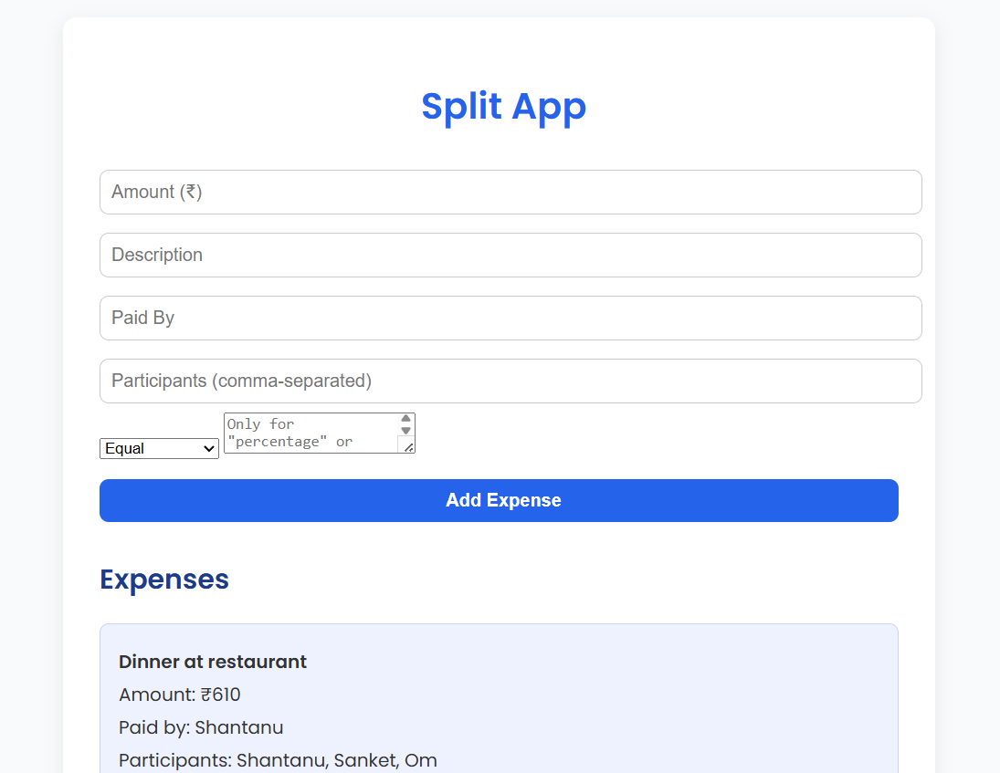
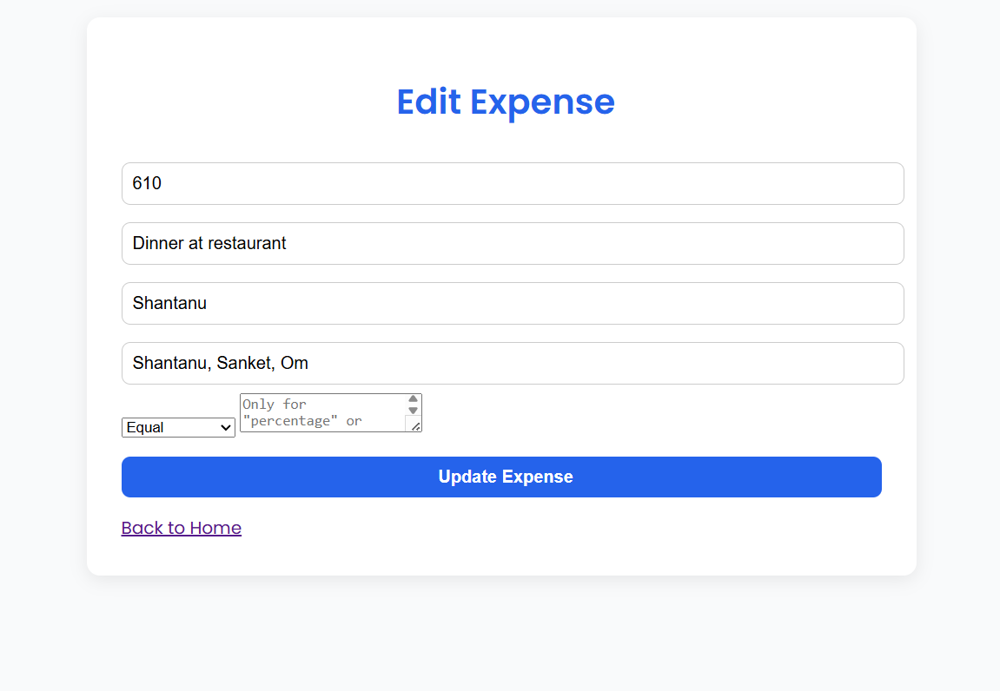
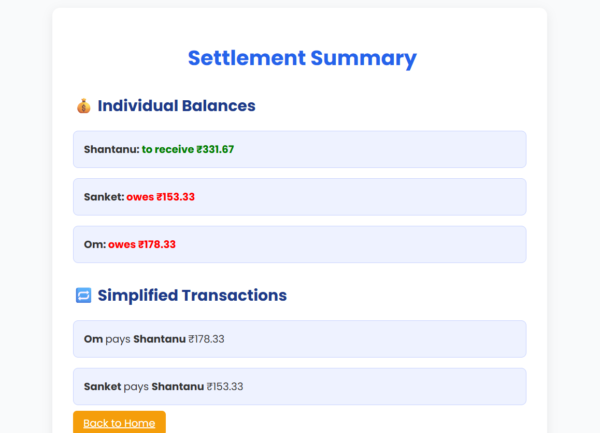

# Expense Split Project

A simple and efficient backend service to split expenses among friends, roommates, or colleagues. Easily track who owes whom and settle up with minimal hassle.

---

## Features

- Create and manage groups for expense splitting
- Add, edit, and delete expenses
- Automatic calculation of balances and settlements
- RESTful API for integration with frontend or third-party apps

---

## Screenshots
<p align="center">
    
</p>
<p align="center">
    
    
</p>
---

## Live Demo & API

- **Live App:** [Deployed Link](https://splitapp-krio.onrender.com/)
- **API Documentation & Testing:** [Postman Collection](https://www.postman.com/avionics-saganist-53291061/my-workspace/example/36927067-43d0eac2-8345-47a8-89b7-318522b62586)

---

## Setup Guide

### Prerequisites

- [Node.js](https://nodejs.org/) (v14 or above)
- [npm](https://www.npmjs.com/) or [yarn](https://yarnpkg.com/)
- [MongoDB](https://www.mongodb.com/) (local or cloud)

### Installation

1. **Clone the repository**
    ```bash
    git clone https://github.com/vjymisal0/SplitApp-Backend.git
    cd SplitApp-Backend
    ```

2. **Install dependencies**
    ```bash
    npm install
    # or
    yarn install
    ```

3. **Configure environment variables**

    Create a `.env` file in the root directory and add the following:
    ```
    PORT=5000
    MONGODB_URI=your_mongodb_connection_string
     ```

4. **Run the server**
    ```bash
    npm start
    # or
    yarn start
    ```

    The server should now be running at `http://localhost:5000`.

---

## Contributing

Pull requests are welcome! For major changes, please open an issue first to discuss what you would like to change.

---


